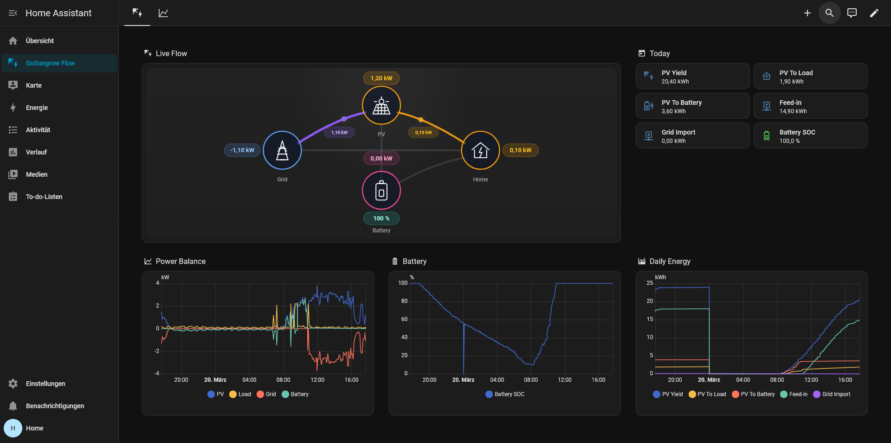
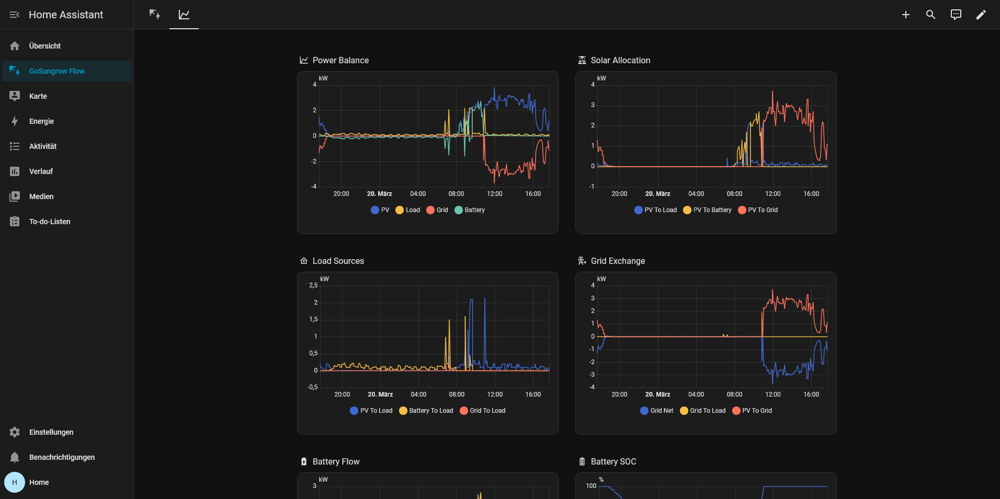

# GoSungrow Home Assistant App

Custom Home Assistant app for Sungrow iSolarCloud.

GoSungrow logs in to iSolarCloud, publishes entities to Home Assistant through MQTT discovery, and installs managed dashboards for live flow and trends.

This repository is based on the original [MickMake/GoSungrow](https://github.com/MickMake/GoSungrow) project and is maintained by [Andreas Roth](https://github.com/roth-andreas) with a focused Home Assistant app deployment model.

## Screenshots

  
  

## Requirements

- Home Assistant installation with app support
- a working MQTT broker and the Home Assistant `MQTT` integration
- an iSolarCloud account
- outbound network access from Home Assistant to iSolarCloud

## Quick Start

1. Install and start the `Mosquitto broker` app in Home Assistant.
2. Confirm `MQTT` appears under `Settings > Devices & services`.
3. In the App Store, add this repository as a custom repository:
   - `https://github.com/roth-andreas/gosungrow-home-assistant`
4. Install `GoSungrow`.
5. Enter your `gosungrow_user` and `gosungrow_password`.
6. Start the app.
7. Open the automatically created `GoSungrow Flow` dashboards from the sidebar.

For almost everyone, the only app settings you need are:

- `gosungrow_user`
- `gosungrow_password`

## What You Get

- MQTT-discovered Sungrow entities in Home Assistant
- a managed `Overview` dashboard for live flow and daily summary
- a managed `Trends` dashboard for deeper energy analysis
- support for `aarch64` and `amd64`

## Configuration

Required:

- `gosungrow_user`
- `gosungrow_password`

Optional:

- `install_dashboard`
- `debug`

Everything else is handled internally by the app:

- the standard iSolarCloud host
- the required app key
- Home Assistant MQTT service wiring
- the managed dashboard URL and title

The app documentation is in `addon/gosungrow/DOCS.md`.

## Notes

- This is not a native Home Assistant integration. MQTT must be working before the app starts.
- The app manages its own dashboard automatically.
- If you are updating from an older version with more options, open the app configuration once and save it to clear legacy fields.
- The repository also includes `examples/home-assistant-energy-cards.yaml` if you want to build a dashboard around Home Assistant's official Energy cards.

## Credit

- Original GoSungrow reverse engineering and codebase: MickMake
- Home Assistant app packaging and maintenance in this repository: [Andreas Roth](https://github.com/roth-andreas)
